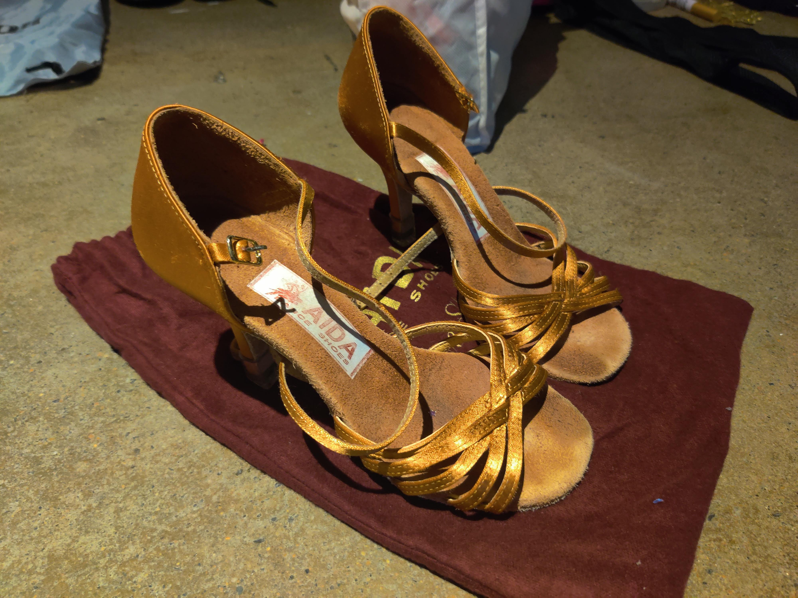

# Ballroomify

<!-- 
 -->
<!--  -->
<!-- 
 -->

Ballroomify is a toy library intended for testing using Sphinx and ReadTheDocs to generate and publish documentation.

And I'm a ballroom dancer, hence the theme.